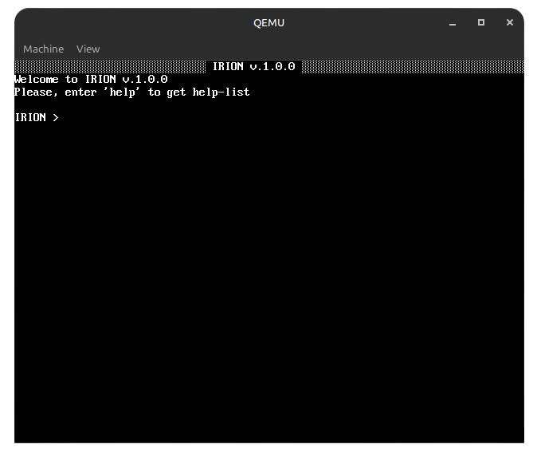

<div align="center">
<h1>Irion</h1>
  
[](#)
[](#)
[](#)


</div>

# 📝 Content
- [About the project](#About-the-project)
- [History](#History)
- [Download](#Download)

# 📋 About the project


Irion is a 16-bit operating system written in NASM. In this operating system, program development is carried out using the [IC32](https://github.com/filcherock/ic32) library. This operating system is under development.

---

## 📋 Supported commands in x16 PRos terminal

- **help** display list of commands
- **cls** clear display
- **reboot** reboot PC
- **shutdown** off PC
- **calc** start calculator
- **load** load disk sector

---

# Irion Software Package


Irion OS has its own software package, here is the list of programs:
- Irion Calculator *(Calculator)*
- Block.Note *(Text editor)*
- FavoRit Code Irion Edition *(Code editor)*

---

# ⚒️ Download
``` bash
# Clone the repository
git clone https://github.com/filcherock/irion.git
cd irion

```

# ⚒️ Compilation
``` bash
# Install the necessary packages
sudo apt install nasm

# Compilation
sh build.sh
```

# 🚀 Launch
``` bash
qemu-system-i386 -hda img/irion.img
```

# Future

In the future, the graphical shell of the system will be developed. At first, there will be a simple old interface, and then we will gradually improve and improve it.

# Screenshot

<div align="center">
  <table>
    <tr>
      <td align="center">
        <strong>Bootloader</strong><br>
        <em>this is bootloader</em><br>
        
      </td>
      <td align="center">
        <strong>OS (Start)</strong><br>
        <em>just launched OS</em><br>
        
      </td>
    </tr>
    <tr>
      <td align="center">
        <strong>Help and Info</strong><br>
        <em>help and info commands</em><br>
        
      </td>
      <td align="center">
        <strong>Calculator</strong><br>
        <em>calculator program</em><br>
        
      </td>
    </tr>
  </table>
</div>

# History
The development of Irion began on August 4, 2025. Initially, it was written in NASM and C++. There was no clear goal for creating the OS, it was developed for educational purposes. On August 8, the developer decided to rewrite Irion OS completely in NASM

# License
Irion OS is distributed under the GNU General Public License. This license applies not only to the OS, but also to all programs and utilities of Irion OS

<div align="center">
  <h3>version in other languages</h3>
  <h2><a href="https://github.com/filcherock/irion/blob/main/README_RU.md">🇷🇺</a> | <a href="https://github.com/filcherock/irion/blob/main/README.md">🇺🇸</a> | <a href="https://github.com/filcherock/irion/blob/main/README_CH.md">🇨🇳</a></h2>
</div>
