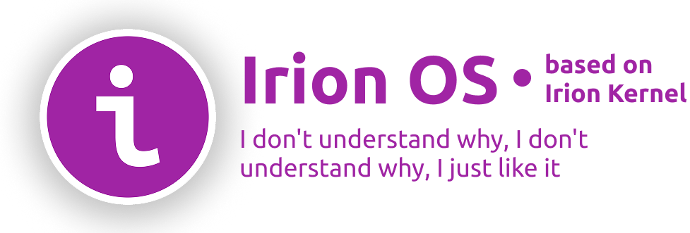

<h1>Irion</h1>
  

# 内容
- [关于项目](#关于项目)
- [故事](#故事)
- 下载

# 关于项目

Irion *(伊里昂)* — 用 NASM 和 C++ 编写的 16 位操作系统。该操作系统正在开发中。

---

# Irion 软件包

Irion OS 有自己的软件包，以下是程序列表：
- Block.Note *(文本编辑器)*
- FavoRit Code Irion Edition *(代码编辑器)*

---

# 故事
Irion 的开发始于 2025 年 8 月 4 日。它最初是用 NASM 和 C++ 编写的。开发该操作系统时并没有明确的目标，而是为了教育目的。
